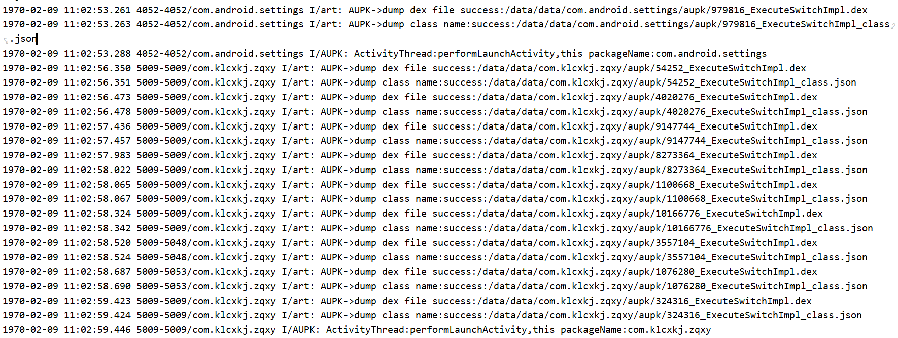
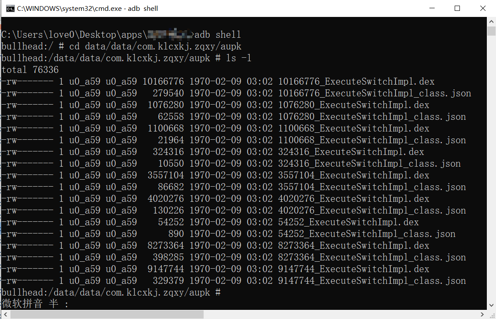
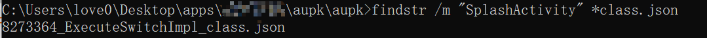
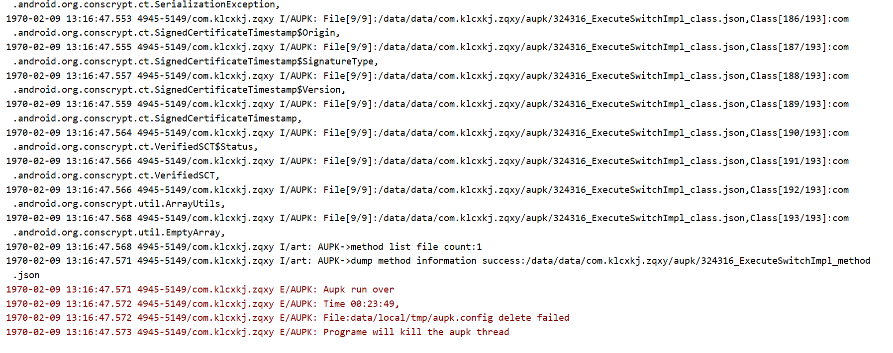
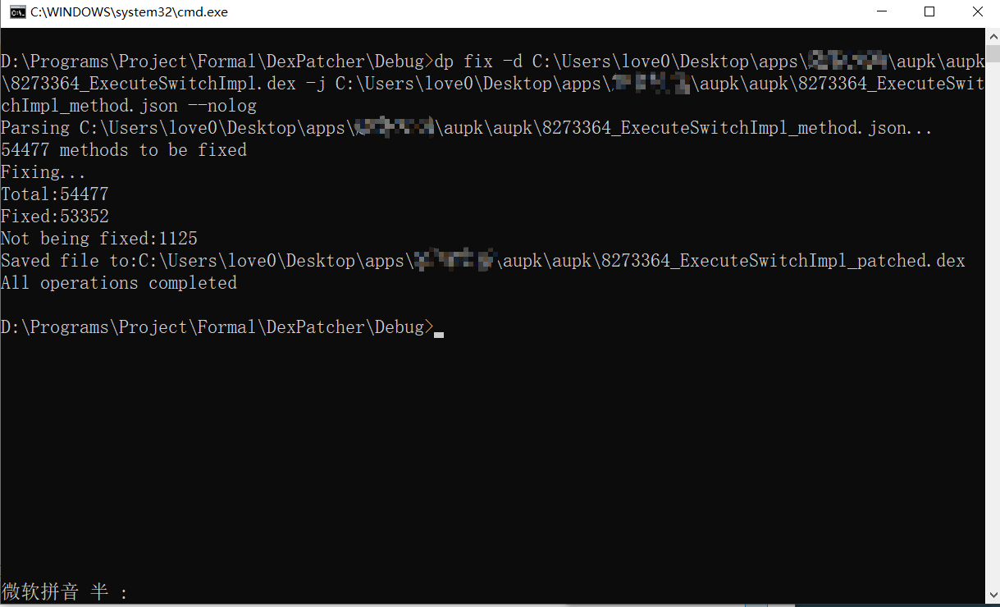
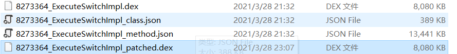
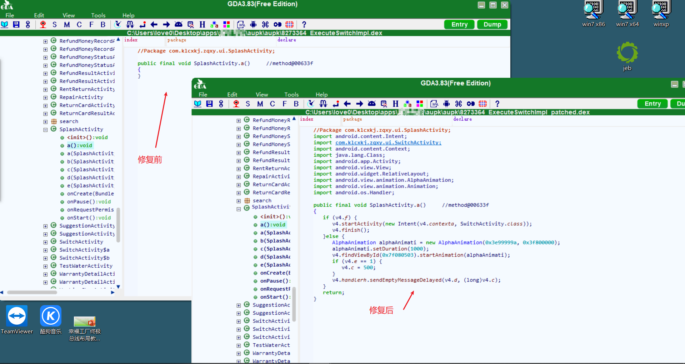

# AUPK

Android Art虚拟机下的主动调用脱壳方案。

该版本在`android 7.1.1_r1`上进行实现，并为Nexuse 5X做了适配（驱动代号NMF26F）。

若需要适配其他版本，请自行移植。

关于AOSP编译，可以参考我的笔记`aosp build.md`；

关于AUPK的原理和流程，请移步看雪：

[AUPK：基于Art虚拟机的脱壳机](https://bbs.pediy.com/thread-266716.htm)

###### 下载：

百度网盘

链接：https://pan.baidu.com/s/1Rj2Un2ox9u08K4p1rPx0Kw 
提取码：aupk 

or

realeases:https://github.com/FeJQ/AUPK/releases


###### 使用方法：

1. 下载镜像，并运行flash.bat刷机

2. 安装，并运行待脱壳的app

3. 获取app的包名，并写入配置文件：

   ```shell
   $ echo "your.app.package">data/local/tmp/aupk.config"
   ```

4. 等待脱壳结束，直到logcat 打印出`Aupk run over`。

5. 使用[DexPatcher](https://github.com/FeJQ/DexPatcher)对Dex文件进行修复

   

###### 示例：

首先安装目标app

```shell
$ adb install your_app
```

运行app，可在logcat看到如下信息：



此时`data/data/your_app/aupk`下多出许多文件

```shell
$ cd data/data/your_app/aupk
$ ls -l
```



其中，`.dex`为整体dump下来的Dex文件，`class.json`记录了Dex文件里所有的类名，前缀数字代表Dex文件的大小。

可以用`findstr`命令来查找某一个类的类名在哪个文件中,如：

```shell
$ findstr /m "SplashActivity" *class.json
```




可以看到，"SplashActivity"类在8273364大小的Dex文件中，那么，我们可以通过以下命令，来写入配置文件

以开始对`8273364_ExecuteSwitchImpl_class.json`里所有的类的所有方法进行主动调用

```shell
$ echo "com.klcxkj.zqxy 8273364_ExecuteSwitchImpl_class.json">data/local/tmp/aupk.config
```

或者对所有的Dex里的类的所有方法进行主动调用：

```shell
$ echo "com.klcxkj.zqxy">data/local/tmp/aupk.config
```

主动调用过程中打印的log:



有的壳hook了Log函数，导致Log.i()打印不出来消息，但jni层的LOG和Log.e()依然有效，当打印出`Aupk run over`时，代表整个主动调用过程结束，可以在`data/data/you_app/aupk`下看到一些以`method.json`结尾的文件，这些文件包含了Dex文件的函数CodeItem信息，用于后面对Dex文件的修复。

并非等整个主动调用过程结束才会生成`method.json`文件，而是每完成对一个`class.json`文件的解析和调用，就会立即生成对应的`method.json`，所以，利用主动调用的这段时间，你可以先修复已经完成了主动调用的Dex文件，或者去泡杯咖啡。

将脱下来的文件拷贝到电脑:

```shell
$ adb pull data/data/your_app/aupk
```

开始修复Dex，回填CodeItem：

```shell
$ dp fix -d 8273364_ExecuteSwitchImpl.dex -j 8273364_ExecuteSwitchImpl_method.json --nolog
```

等待片刻，即可完成修复：



带patched后缀的就是修复后的Dex文件



反编译看看效果：

